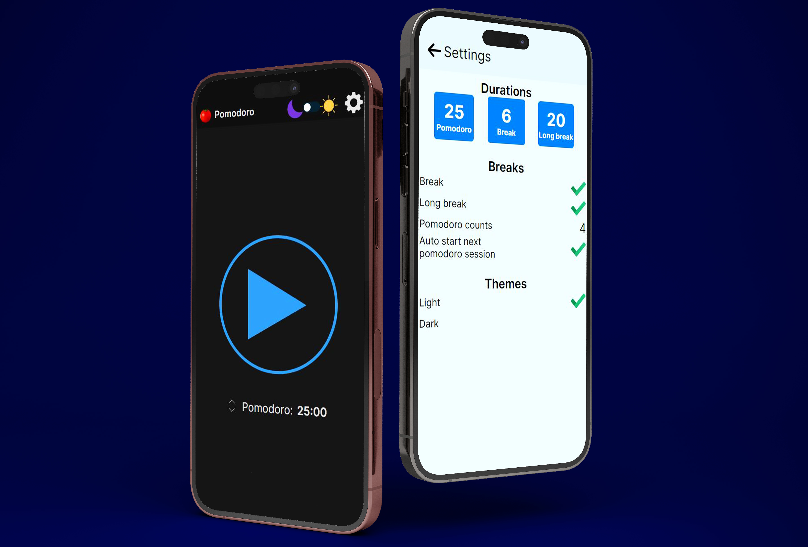

# Telegram Clone app, i will rename it later

Telegram Clone - just a simple messenger

## Server

- Java
- Spring
- MongoDB
- Docker

## Mobile (only android)

- Kotlin
- Android Studio
- Appium
- ?????

## Web Application - maybe a liiiitle later

- React
- Redux Toolkit
- TypeScript
- Webpack

## Figma

<https://www.figma.com/design/g7S6OMRMotuRsAaj1Z6CRC/Hamster-messenger>

## Web

https://...........

## Google Play

<https://play.google.com/store/apps/.........>

i will change img later

